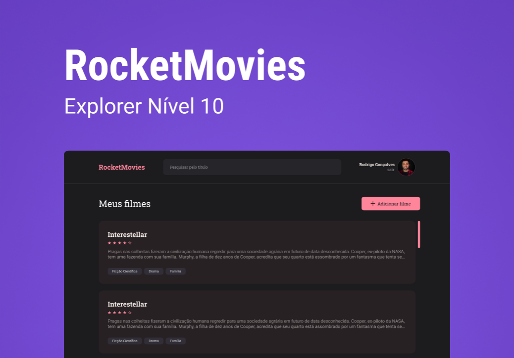

<h1 align="center">RocketMovies</h1>





<div align="center">


## 🧐 Sobre <a name = "about_pt"></a>
Este projeto foi criado durante o curso Exporer da Rocketseat, com o objetivo de listar os seus filmes favoritos, podendo dar a cada um deles uma nota de 0 a 5 e uma descrição ou avaliação da sua escolha.

## 🏁 Iniciando o projeto <a name = "getting_started_pt"></a>

Essas instruções vão te guiar para ter uma cópia da aplicação funcionando em sua máquina local.

### Pré-requisitos

Inicialmente você vai precisar de alguns programas instalados para que consiga fazer uso:

- [Visual Studio Code](https://code.visualstudio.com) - Editor de código
- [Node.js + npm](https://nodejs.org/en) - Versão LTS recomendada

### Instalando

Instruções passo a passo para utilizar a aplicação:

Feita a instalação mencionada, faça uma cópia do código fonte ou o download para sua máquina.

Abra os arquivos com o VSCODE e em seguida, abra o seu terminal integrado e execute o seguinte código:
```
npm install
```
Esse comando irá instalar todas as dependências necessárias para que consiga utilizar a aplicação.


## 🎈 Usando <a name="usage_pt"></a>

Primeiramente, acesse o arquivo "api.js", localizado dentro da pasta "src/services" e selecione a url do backend que deseja utilizar. *

Tendo executado o servidor local e com a cópia do backend em execução, execute a linha de comando a seguir para iniciar o servidor local:
```
npm run dev
```

Após, clique no link informado no terminal ou o digite no seu navegador:
```
http://localhost:5173
```

Com isso, você deverá conseguir acessar a aplicação normalmente


